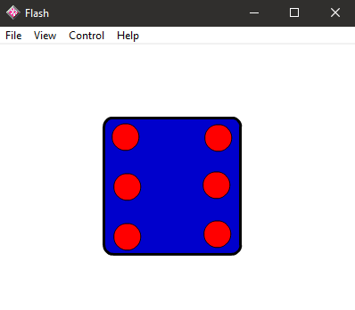

# Dice - "Kostky"  
  
### One of my very first games/apps, made back in ~2001. ^^  
  
  
  
[RELEASE DOWNLOAD](https://github.com/Dark-Gran/Simple-Dice6/releases/tag/1.0)  
  
**_Does NOT require the Flash Player._**  
  
A simple simulation of a six-sided dice, made in Macromedia Flash (AS1).  
  
_Side-note:  
"Kostky" is a plural, the singular word for dice in czech is "kostka" (which could be translated as "a little bone" as well, but is never used in that sense)._  
  
  
